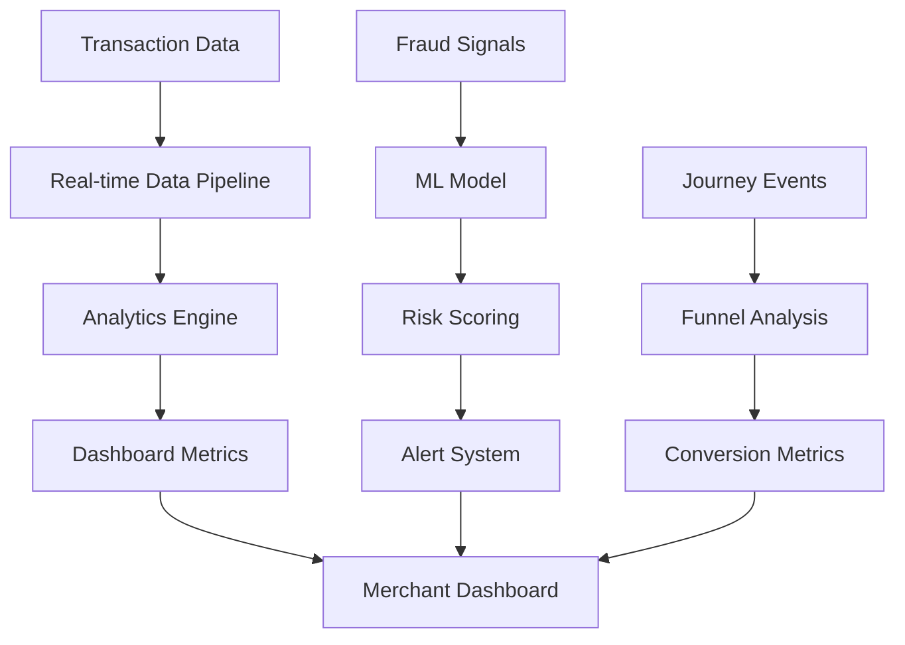

# Merchant Dashboard & Payment Analytics PRD

**Proje Adı:** Merchant Dashboard ve Payment Analytics  
**Versiyon:** 1.0  
**Tarih:** 07 Ocak 2025  
**Hazırlayan:** Hepsipay Geliştirme Ekibi  

---

## 1. Introduction

### 1.1 Amaç
Merchant paneline kapsamlı bir dashboard ve raporlama merkezi ekleyerek, merchant'ların ödeme performanslarını anlık olarak takip edebilmelerini ve detaylı analizler yapabilmelerini sağlamak.

### 1.2 Kapsam
- Ana dashboard sayfası (genel KPI'lar ve özetler)
- Detaylı payment analytics raporlama sayfası
- Real-time fraud monitoring
- Journey analytics ve conversion tracking
- Payment method optimization insights

### 1.3 Hedef Kitle
- Merchant kullanıcıları
- Business Intelligence ekipleri
- Risk ve fraud analisti ekipleri
- Executive management

---

## 2. Overview

### 2.1 İş Hedefleri
- Merchant'ların ödeme performansını optimize etmelerini sağlamak
- Fraud'ı erkenden tespit edebilme kabiliyeti geliştirmek
- Customer journey'deki bottleneck'leri belirlemek
- Data-driven karar alabilme altyapısı sunmak

### 2.2 Başarı Kriterleri
- Dashboard sayfa yükleme süresi < 3 saniye
- Fraud detection accuracy > 95%
- Merchant satisfaction score artışı > 20%
- False positive rate < 2.5%

### 2.3 Business Değer
- Merchant retention artışı
- Operational efficiency iyileştirmesi
- Risk azaltma
- Revenue optimization

---

## 3. System Processes

### 3.1 Dashboard Veri Akışı



### 3.2 Veri İşleme Süreçleri
1. **Real-time Stream Processing**: Transaction events anlık olarak işlenir
2. **Batch Processing**: Günlük raporlar ve trend analizleri
3. **ML Pipeline**: Fraud detection ve risk scoring
4. **Data Aggregation**: KPI'ların hesaplanması ve cache'lenmesi

### 3.3 İş Kuralları
- Veriler 7/24 real-time olarak güncellenir
- Fraud alertleri 30 saniye içinde görüntülenir
- Tüm raporlar export edilebilir (PDF, Excel)
- Tarih filtreleme: Son 24 saat, 7 gün, 30 gün, 90 gün, özel tarih

---

## 4. UI/UX

### 4.1 Dashboard Tasarım Prensipleri
- **Modern Fintech Aesthetic**: Card-based layout, modern color palette
- **Responsive Design**: Mobil ve desktop uyumluluğu
- **Dark/Light Theme**: Kullanıcı tercihi desteklenir
- **Accessibility**: WCAG 2.1 AA compliance

### 4.2 Sayfa Yapıları

#### 4.2.1 Ana Dashboard
- **Header**: Tarih filtreleri, export butonları
- **KPI Cards**: Total transactions, volume, success rate, fraud rate
- **Charts Section**: 
  - Payment performance trend (line chart)
  - Journey analytics (metric cards)
- **Bottom Section**:
  - Fraud analytics (pie chart)
  - Payment methods distribution (donut chart)
  - Recent alerts (notification cards)

#### 4.2.2 Payment Reports Sayfası
- **Navigation Tabs**: Overview, Performance, Journey, Fraud, Methods
- **Interactive Charts**: Drill-down özellikli grafikler
- **Export Options**: PDF, CSV, Excel formatları
- **Real-time Updates**: Auto-refresh seçenekleri

### 4.3 Chart Türleri ve Kullanım Alanları
- **Line Charts**: Trend analizi (success rate, volume over time)
- **Bar Charts**: Karşılaştırmalar (hourly patterns, channel performance)
- **Pie/Donut Charts**: Oransal dağılımlar (fraud types, payment methods)
- **Area Charts**: Hacimsel veriler (transaction volumes)
- **Funnel Charts**: Conversion analysis (customer journey)
- **Gauge Charts**: KPI göstergeleri (real-time metrics)

---

## 5. Technical Implementation

### 5.1 Teknoloji Stack'i
- **Frontend**: React, TypeScript, Tailwind CSS
- **Charts**: Recharts library
- **State Management**: React hooks
- **Routing**: React Router
- **Build Tool**: Vite

### 5.2 Performance Optimizations
- **Data Virtualization**: Büyük veri setleri için
- **Lazy Loading**: Chart componentlerin ihtiyaç anında yüklenmesi
- **Memoization**: Expensive calculations için
- **CDN Integration**: Static assets için

### 5.3 API Endpoints
```
GET /api/dashboard/overview
GET /api/dashboard/performance
GET /api/dashboard/journey-analytics
GET /api/dashboard/fraud-analytics
GET /api/dashboard/payment-methods
POST /api/reports/generate
GET /api/reports/export/{format}
```

---

## 6. Audit & Security

### 6.1 Güvenlik Gereksinimleri
- Sadece yetkili merchant kullanıcıları erişebilir
- API rate limiting: 100 req/min per user
- Data masking: Sensitive payment information
- HTTPS only, secure headers

### 6.2 Audit Requirements
- Tüm dashboard erişimleri log'lanır
- Export işlemleri tracked edilir
- Filter değişiklikleri audit trail'e eklenir
- Performance metrics monitör edilir

### 6.3 Compliance
- PCI DSS compliance
- GDPR data protection
- SOX financial reporting requirements

---

## 7. Use Cases

### 7.1 UC001: Daily Performance Monitoring
**Actor**: Merchant User  
**Goal**: Günlük ödeme performansını kontrol etmek  
**Steps**:
1. Merchant dashboard'a login olur
2. Ana dashboard sayfasını görüntüler
3. KPI kartlarında günlük metrikleri inceler
4. Trend chartlarında performans değişimlerini analiz eder
5. Gerekli aksiyonları planlar

### 7.2 UC002: Fraud Investigation
**Actor**: Risk Analyst  
**Goal**: Şüpheli işlemleri araştırmak  
**Steps**:
1. Fraud analytics tabını açar
2. Fraud type distribution'ı inceler
3. Channel-based fraud rates'i analiz eder
4. Alert detaylarını görüntüler
5. Mitigation planını oluşturur

### 7.3 UC003: Journey Optimization
**Actor**: Business Analyst  
**Goal**: Conversion rates'i optimize etmek  
**Steps**:
1. Journey analytics sayfasını açar
2. Funnel analysis'i inceler
3. Drop-off noktalarını belirler
4. A/B test planları oluşturur
5. Implementation roadmap'i hazırlar

### 7.4 UC004: Monthly Reporting
**Actor**: Executive  
**Goal**: Aylık performance raporunu hazırlamak  
**Steps**:
1. Reports sayfasını açar
2. Tarih filtrelerini 30 gün olarak ayarlar
3. Comprehensive report generate eder
4. PDF formatında export eder
5. Stakeholder'larla paylaşır

---

## 8. Non-Technical Requirements

### 8.1 Performance Requirements
- **Load Time**: Dashboard < 3 saniye
- **Chart Rendering**: < 1 saniye
- **Data Refresh**: Real-time (< 30 saniye delay)
- **Concurrent Users**: 1000+ simultaneous users

### 8.2 Availability Requirements
- **Uptime**: 99.9% availability
- **Maintenance Window**: Pazar 02:00-04:00
- **Disaster Recovery**: < 4 saat RTO
- **Backup**: Günlük automated backups

### 8.3 Scalability Requirements
- **Data Volume**: 1M+ transactions/day support
- **User Growth**: 10x user increase capability
- **Geographic**: Multi-region deployment ready
- **API**: Auto-scaling endpoints

---

## 9. Implementation Roadmap

### 9.1 Faz 1 - Core Dashboard (4 hafta)
- Ana dashboard layout ve navigation
- Basic KPI cards implementation
- Payment performance chart
- Mobile responsive design

### 9.2 Faz 2 - Analytics & Reports (6 hafta)
- Detaylı reports sayfası
- Interactive chart library integration
- Export functionality
- Advanced filtering options

### 9.3 Faz 3 - Advanced Features (4 hafta)
- Real-time fraud monitoring
- Journey analytics
- Automated alerting system
- Performance optimizations

### 9.4 Faz 4 - Enhancement (2 hafta)
- Dark/light theme toggle
- Custom dashboard widgets
- Advanced export formats
- User preference settings

---

## 10. Glossary

### 10.1 Business Terms
- **CR (Conversion Rate)**: Tamamlanan işlem / Başlatılan işlem oranı
- **CTR (Click Through Rate)**: Tıklanan link / Gösterilen link oranı
- **Linkleme Oranı**: Kart bilgilerinin doğru şekilde bağlanma oranı
- **3D/Non-3D Oranı**: 3D Secure kullanılan işlem oranı
- **Journey**: Kullanıcının ödeme başlatmadan tamamlama'ya kadar geçen süreç

### 10.2 Technical Terms
- **Direct Reject**: Fraud sistemi tarafından direkt reddedilen işlemler
- **Monitoring**: Risk skoruna göre izlemeye alınan ama geçirilen işlemler
- **False Positive**: Yanlış fraud alarm oranı
- **Authorization Rate**: Başarılı yetkilendirme oranı

### 10.3 Chart Types
- **Line Chart**: Trend analizi için kullanılan zaman serisi grafiği
- **Donut Chart**: Merkezi boş dairesel grafik, oransal dağılım için
- **Funnel Chart**: Conversion sürecini gösteren huni grafiği
- **Gauge Chart**: Anlık değer göstergesi, metre benzeri görünüm

---

## 11. UAT Test Scenarios

### 11.1 Dashboard Functionality Tests
1. **Test Case 1**: Ana dashboard yükleme performansı
   - Expected: Sayfa 3 saniye içinde yüklenir
   - Validation: Network tab ile timing ölçümü

2. **Test Case 2**: KPI kartlarının doğruluğu
   - Expected: Backend API ile frontend gösterimleri eşleşir
   - Validation: API response ile UI karşılaştırması

3. **Test Case 3**: Chart interactivity
   - Expected: Chart hover, zoom, drill-down çalışır
   - Validation: Mouse interaction ve data visibility

### 11.2 Reports Functionality Tests
4. **Test Case 4**: Tab navigation
   - Expected: Tüm tabs hatasız açılır ve data yüklenir
   - Validation: Her tab için data existence kontrolü

5. **Test Case 5**: Export functionality
   - Expected: PDF, CSV, Excel export çalışır
   - Validation: File download ve content verification

6. **Test Case 6**: Date filtering
   - Expected: Tarih filtreleri chart data'yı günceller
   - Validation: API call monitoring ve data change

### 11.3 Performance Tests
7. **Test Case 7**: Mobile responsiveness
   - Expected: Tüm cihaz boyutlarında düzgün görünüm
   - Validation: Chrome DevTools device simulation

8. **Test Case 8**: Concurrent user load
   - Expected: 100+ kullanıcı ile performans degradation yok
   - Validation: Load testing tools ile response time ölçümü

### 11.4 Security Tests
9. **Test Case 9**: Unauthorized access
   - Expected: Login olmayan kullanıcı dashboard'a erişemez
   - Validation: 401/403 response codes

10. **Test Case 10**: Data masking
    - Expected: Sensitive payment data masked
    - Validation: Console ve network tab kontrolleri

---

**Onay:** [Executive Sponsor]  
**Review:** [Technical Lead]  
**Date:** 07 Ocak 2025 